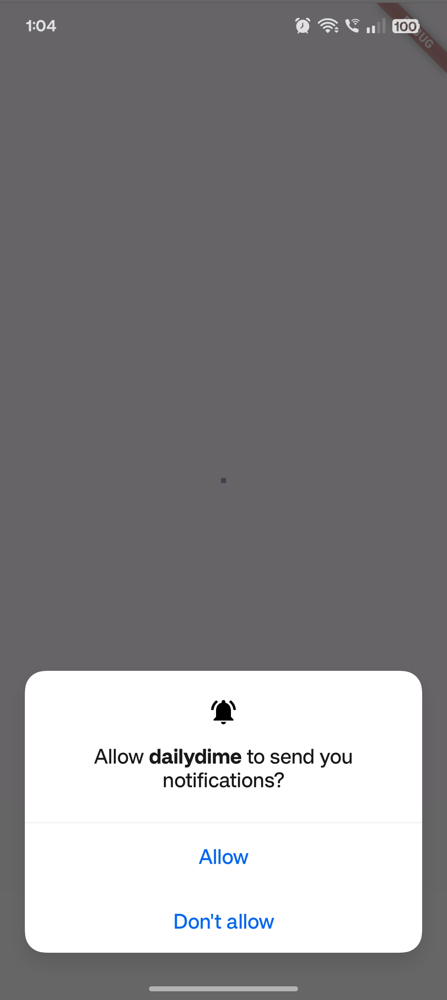
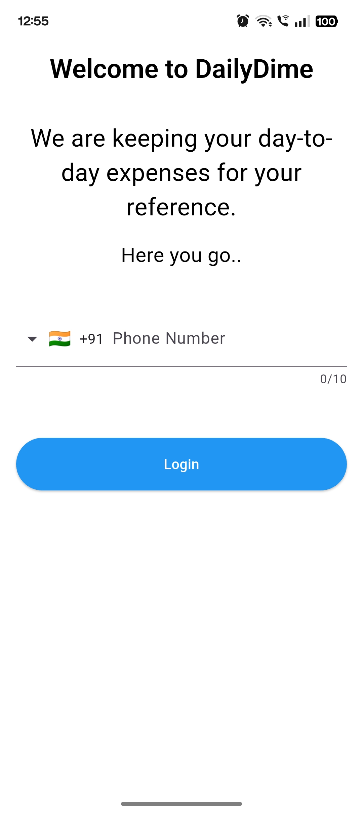
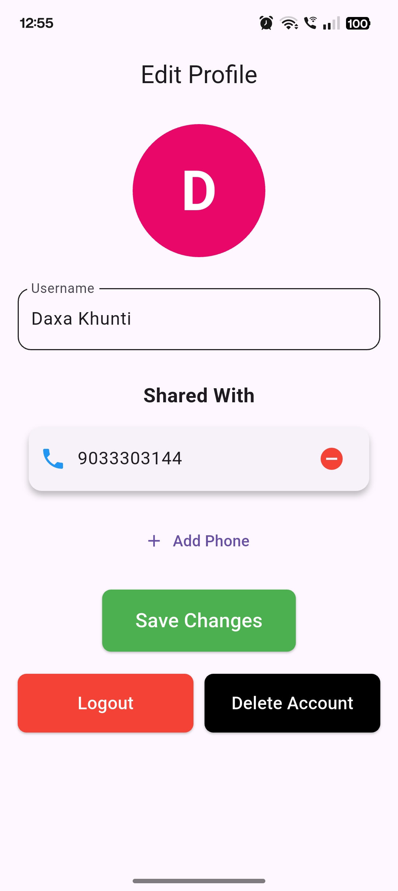
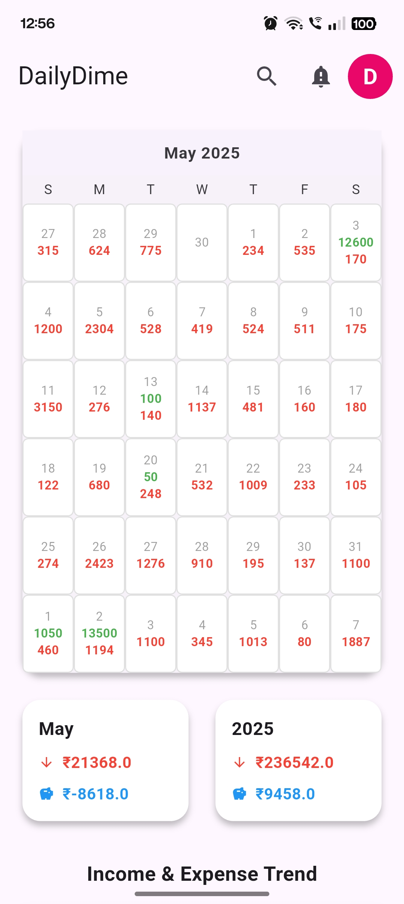
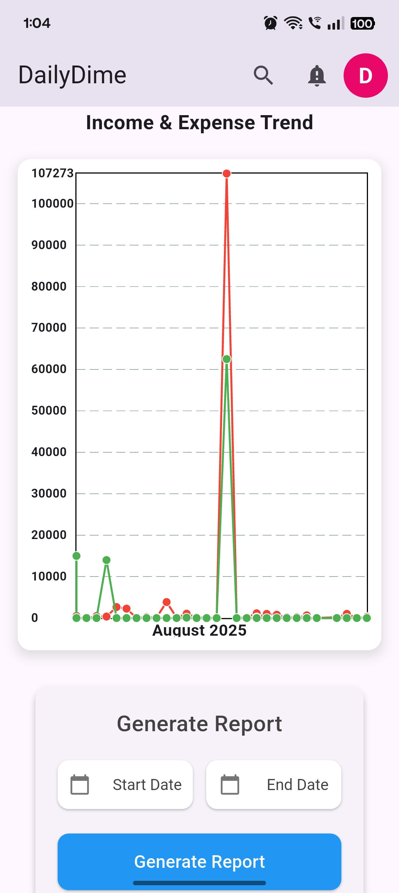
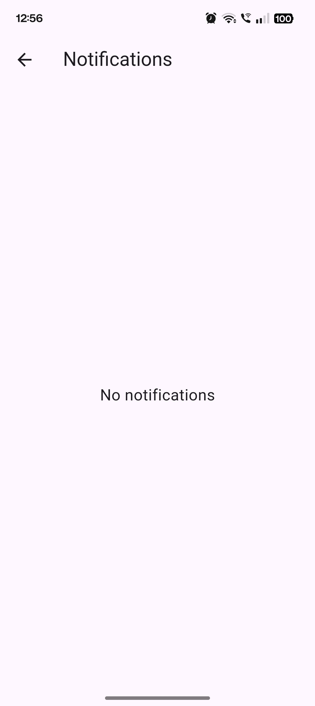
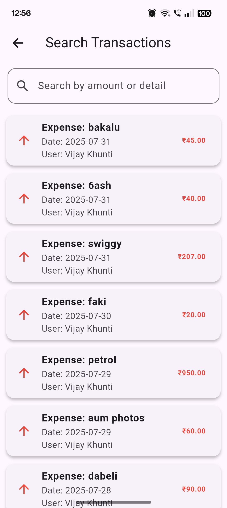
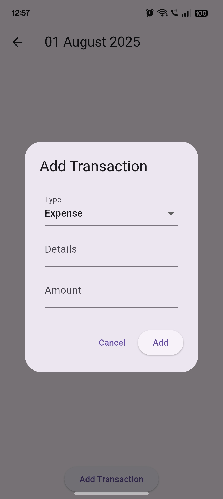
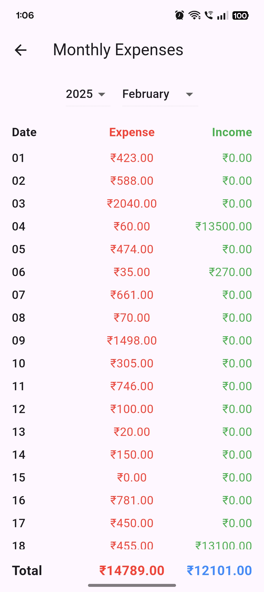
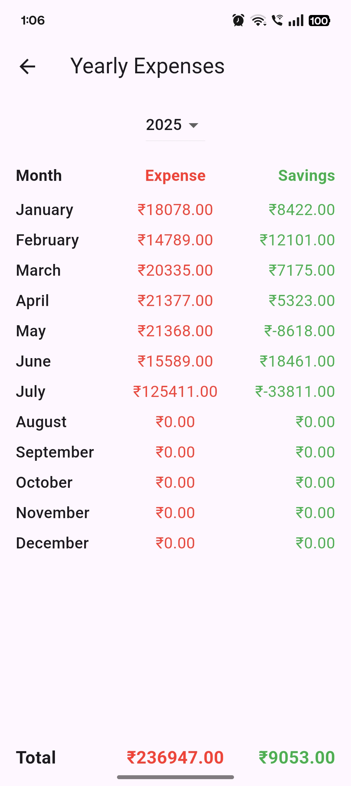

💰 DailyDime App

A modern and intuitive finance management app built with **Flutter**.  
DailyDime helps you track your expenses, manage budgets, and monitor your financial health with a clean and user-friendly interface.

📱 Screenshots

  
  
  
  
   

 
  
  
  
  
  

  

✨ Key Highlights

- 📊 Track daily expenses and income
- 🏦 Set budgets and monitor spending
- 📈 Visualize financial data with charts and summaries
- 🔔 Receive notifications and reminders for bills
- 📱 Cross-platform app (Android & iOS) built with Flutter

🚀 About This Repository

This repository is intended only for showcasing the app with screenshots and demo.  
The source code is not publicly shared.

📬 Contact

If you’re interested in this project or would like to collaborate, feel free to reach out!
